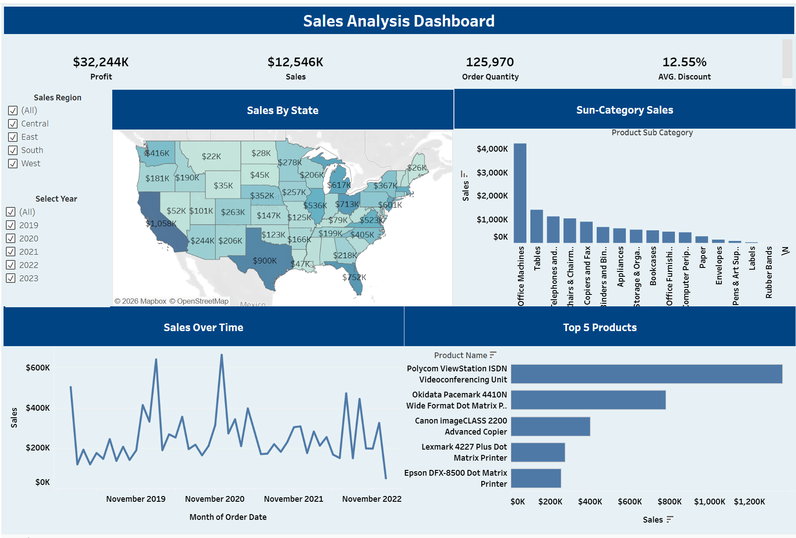
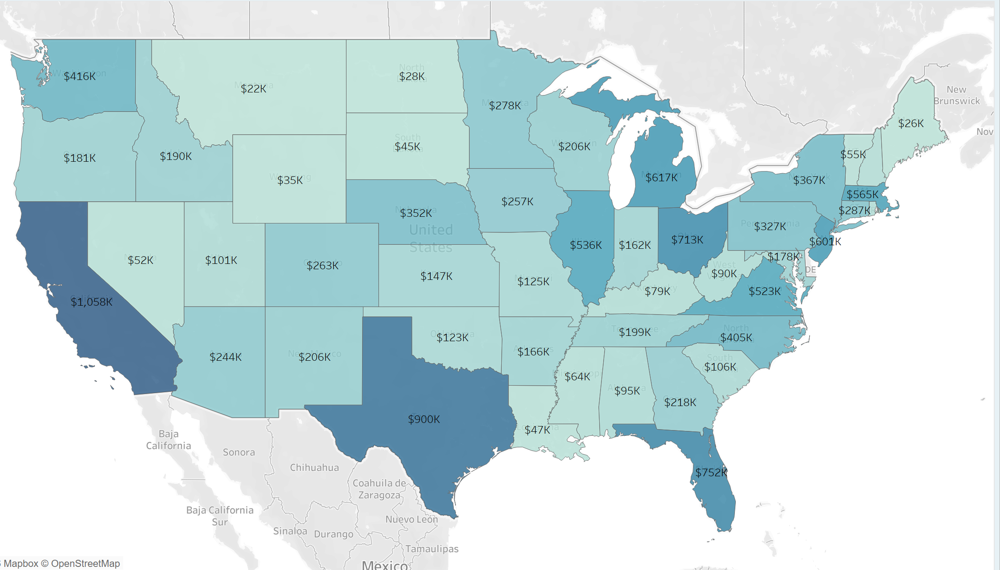
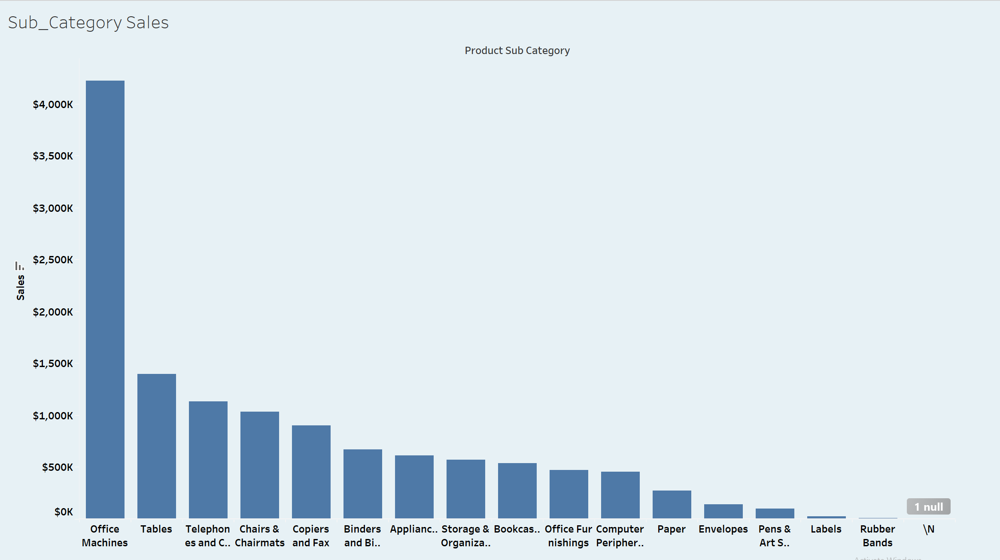
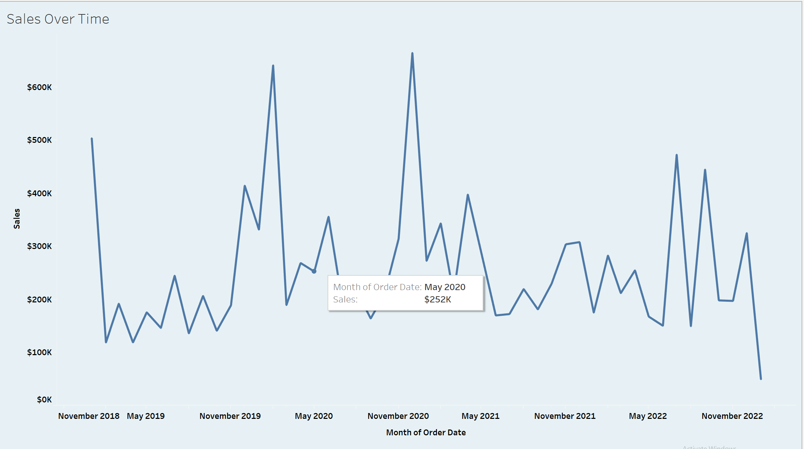
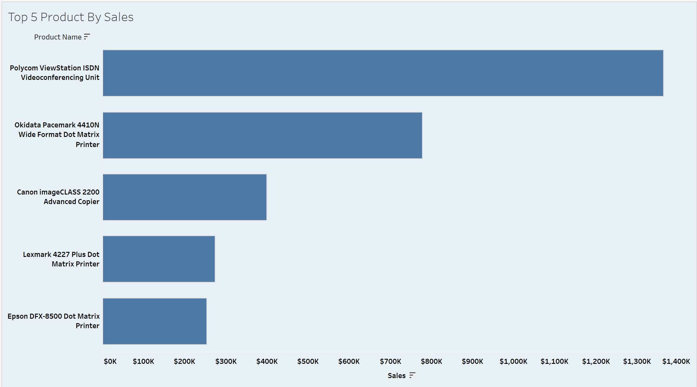

Walmart Sales Analysis Dashboard (Tableau)

This project is an interactive Tableau dashboard built to analyze Walmart retail sales performance across regions, time, and product categories. The goal was to create a clear, decision-focused view of sales, profit, and product trends that can be explored by business users without technical knowledge.

The dashboard summarizes overall performance using KPIs and allows deeper analysis through geographic, temporal, and product-level visualizations.

Live dashboard:
https://public.tableau.com/app/profile/chinenye.onyedika2385/viz/TableauProject1_17671288446640/Dashboard1

Dashboard Overview

The dashboard opens with four high-level KPIs that provide a snapshot of business performance:

Total Profit

Total Sales

Order Quantity

Average Discount

These KPIs update dynamically based on selected filters.

Sales by State

A filled U.S. map displays total sales by state, making it easy to identify strong and weak performing regions. States such as California, Texas, and New York stand out as major contributors to overall revenue.

This view helps highlight regional patterns that can guide sales strategy and resource allocation.

Sales by Product Sub-Category

This bar chart compares sales across product sub-categories. Office Machines lead sales by a significant margin, followed by Tables and Telephones, while several categories contribute relatively smaller shares.

The visualization supports product mix analysis and inventory prioritization.

Sales Over Time

Monthly sales trends from 2019 to 2022 reveal fluctuations and seasonal patterns. Peaks and dips over time provide insight into demand cycles and help support forecasting and planning decisions.

Top 5 Products by Sales

This chart ranks the top five products by total sales. The Polycom ViewStation ISDN Videoconferencing Unit is the highest-selling product, clearly outperforming others.

This view helps identify key revenue drivers at the product level.

Filters and Interactivity

The dashboard includes interactive filters that allow users to:

Filter by sales region (Central, East, South, West)

Filter by year (2019–2023)

These controls enable focused analysis without modifying the dashboard structure.

Tools Used

Tableau Desktop

Tableau Public

Walmart retail sales dataset

Data cleaning and preparation performed prior to visualization

Author

Chinenye Onyedika

Data Analyst

Tableau & Power BI Specialist

Windsor, Ontario, Canada

GitHub: https://github.com/Joyerics

LinkedIn: https://linkedin.com/in/chinenye-onyedika-889087232